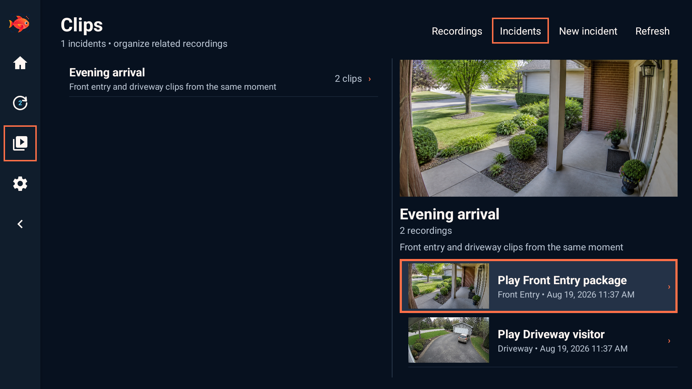

# Opah interface gallery

Every image below is a 1920×1080 Android TV screenshot made with fictional
example data and generated camera scenes. No real camera, account, server, or
private address appears in the gallery.

## Start and connection states

| Connecting | Connection setup |
| --- | --- |
|  |  |

| Recoverable connection failure |
| --- |
|  |

## Home and navigation

| Home | Expanded navigation |
| --- | --- |
|  |  |

## Cameras and live views

| Create a camera view | Birdseye playback |
| --- | --- |
|  |  |

| Four-camera view | Camera controls |
| --- | --- |
|  |  |

## Activity

| New activity | Selected activity |
| --- | --- |
|  |  |

| History | Search |
| --- | --- |
|  |  |

## Clips

| Saved recordings | Incidents |
| --- | --- |
|  |  |

## Playback

| Live playback | Recorded playback |
| --- | --- |
|  |  |

| Picture-in-picture |
| --- |
|  |

## Server

| Performance | Storage |
| --- | --- |
|  |  |

## Settings and updates

| Settings | Up to date |
| --- | --- |
|  |  |

| Custom color example | Device information |
| --- | --- |
|  |  |

## About

| Project information and disclosures |
| --- |
|  |
